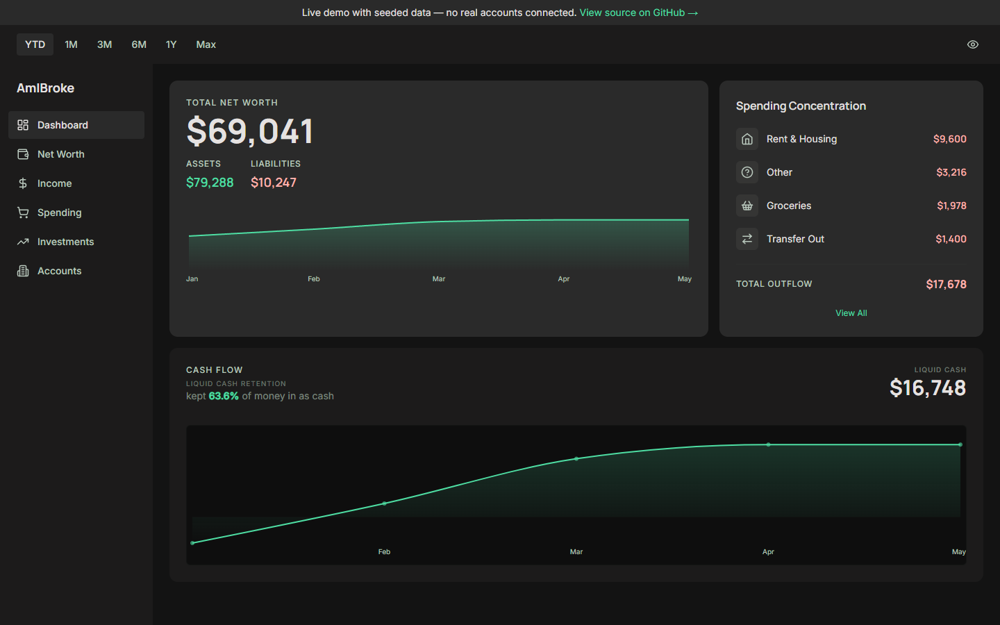
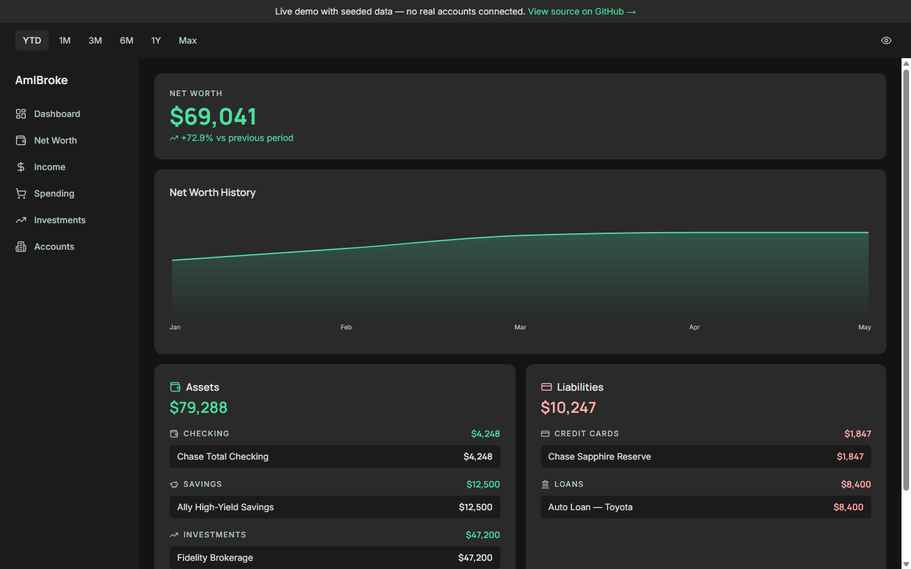
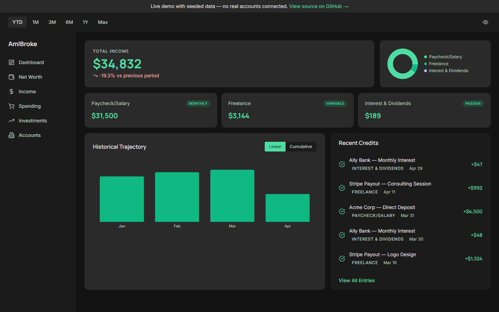
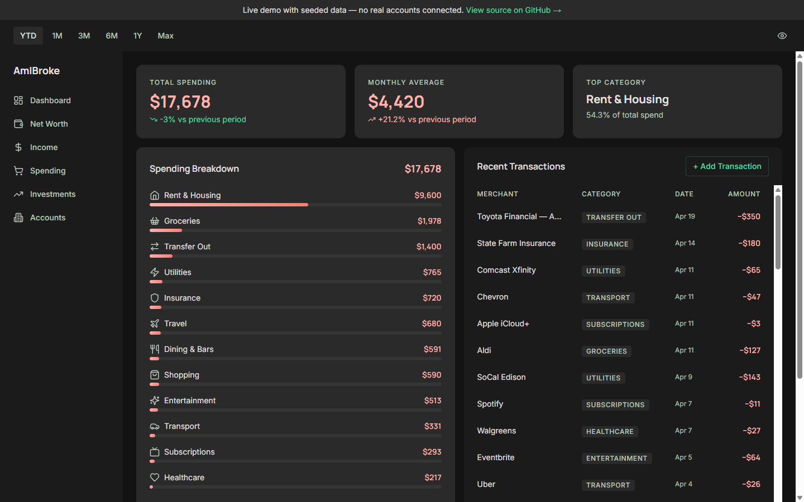
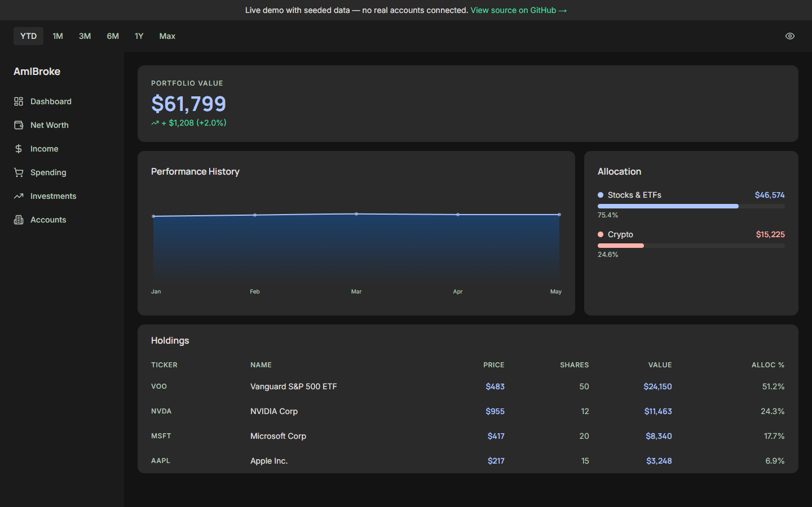
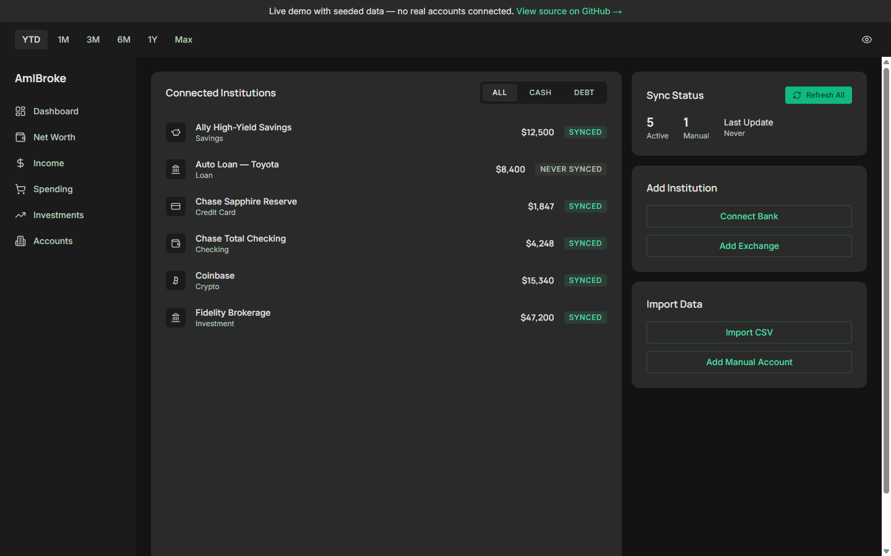

# AmIBroke

> Self-hosted personal finance dashboard — syncs bank accounts, investments, and crypto into one dark-mode desktop app for a single user on a local network.
>
> **AI accountability layer in progress.**

**[Live demo →](https://swarnimb.github.io/personal-FA/)** &nbsp;·&nbsp; pre-seeded fictional data — no real accounts connected.



---

## What it is

AmIBroke is a single-user, self-hosted finance tracker. It pulls bank accounts via SimpleFin, brokerage positions via the brokerages' own APIs, and crypto holdings via Coinbase and Kraken — then renders the lot in a dark, desktop-only dashboard you run on your own machine.

Three things make it different from the SaaS alternatives:

- **All financial math lives in PostgreSQL views**, not in application code. Net worth, liquid cash, cash flow, and spending breakdown are computed by the database. The app layer never does arithmetic on money.
- **All API credentials are AES-256-GCM encrypted** before they touch the database, decrypted only at sync time. No plaintext keys at rest.
- **No auth, no cloud, no account.** The app binds to `0.0.0.0` and runs on your LAN. Single user, single household, your hardware.

An **AI accountability layer is in progress** — surfacing spending patterns, anomalies, and prompts grounded in your actual ledger. Not in the demo yet.

---

## Live demo

**[https://swarnimb.github.io/personal-FA/](https://swarnimb.github.io/personal-FA/)**

The demo is the full app, statically exported and served from GitHub Pages with **pre-seeded fictional data** — no real accounts, no live sync, no writes. Connect-account buttons no-op with a toast. Use it to feel the shape of the product before you clone it.

---

## Screenshots

Ordered as they appear in the app sidebar.

| Tab | Preview |
| --- | --- |
| Dashboard |  |
| Net Worth |  |
| Income |  |
| Spending |  |
| Investments |  |
| Accounts |  |

A privacy "Hide amounts" toggle in the header masks every dollar value in one click — useful when screen-sharing.

---

## Tech stack

| Layer | Choice |
| --- | --- |
| Framework | Next.js 15.5.14 (App Router) + TypeScript 5 |
| Database | PostgreSQL (native install, runs as a service) |
| ORM | Prisma 5.22 — pinned (see `docs/founder-brief.md` FB-06 for the v7 incompatibility) |
| UI | Tailwind CSS 3.4 + shadcn/ui pattern over Radix UI primitives |
| Charts | Recharts 3 |
| Cron | node-cron 4, initialized in `src/instrumentation.ts` |
| Bank sync | SimpleFin Bridge API |
| Crypto sync | Coinbase Advanced Trade API · Kraken REST API |

Design system: **The Velvet Ledger** — dark only, desktop only (1280px+). See `docs/design-decisions.md`.

---

## One-command local setup

Requires Node 20+ and a running PostgreSQL instance.

```sh
npm ci && cp .env.example .env && npx prisma migrate dev && npm run dev
```

Open `http://localhost:3000`. The dev server binds to `0.0.0.0` — other devices on your LAN reach it at `http://<your-host-ip>:3000`.

**Before first boot, fill in these `.env` values:**

| Variable | Required | Purpose |
| --- | --- | --- |
| `DATABASE_URL` | ✅ | PostgreSQL connection string |
| `ENCRYPTION_KEY` | ✅ | 32-byte hex for AES-256-GCM. Generate with `node -e "console.log(require('crypto').randomBytes(32).toString('hex'))"` |
| `SIMPLEFIN_ACCESS_URL` | optional | Required if you want bank sync |
| `COINBASE_API_KEY` / `COINBASE_API_SECRET` | optional | Required if you want Coinbase sync |
| `KRAKEN_API_KEY` / `KRAKEN_API_SECRET` | optional | Required if you want Kraken sync |
| `CRON_HOUR` | optional | Defaults to `2` — hour of day for the nightly sync |

The app boots empty without any sync providers configured; bank and crypto integrations are additive.

### Enable the seed-demo PII guard (one-time)

`prisma/seed-demo.ts` powers the public demo, which means it ships to this **public** repository. The repo includes a pre-commit hook that refuses commits touching the seed file unless you type a confirmation phrase. Enable it once per clone:

```sh
git config core.hooksPath .githooks
```

The hook is at `.githooks/pre-commit`. It blocks non-interactive shells outright. You can always bypass deliberately with `git commit --no-verify`.

---

## Run the demo locally

Build and serve the static demo (no database required):

```sh
NEXT_PUBLIC_DEMO_MODE=true npm run build && npx serve out
```

PowerShell variant (Windows):

```powershell
$env:NEXT_PUBLIC_DEMO_MODE='true'; npm run build; npx serve out
```

Uses the pre-seeded fictional dataset in `prisma/seed-demo.ts` — no real accounts, no outbound API calls.

---

## Testing

```sh
npm test                       # unit tests (vitest, node environment)
npm run test:integration       # integration tests (uses TEST_DATABASE_URL — must contain "test" in the name)
```

---

## Repo vs product name

The GitHub repo is **`personal-FA`** for historical reasons — it started life as a private personal-finance side project. The product is **AmIBroke**. All in-app strings, page title, sidebar branding, and this README use **AmIBroke**. If you arrived expecting "personal-FA" the app, you're in the right place.
